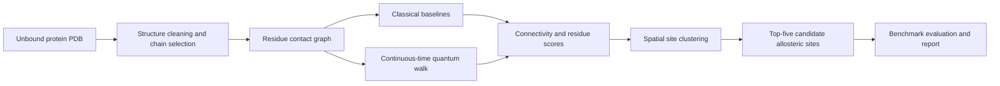

# ProPulse

## Quantum-enhanced graph modeling for allosteric signal propagation in proteins

> **Project status:** Early-stage research project — research direction and system design are being established; the executable pipeline and benchmark results are not yet available.

ProPulse is a research-oriented computational biology project that investigates whether quantum-walk-based models can provide useful and interpretable descriptions of signal propagation through protein structures.

The project starts from a static, unbound protein structure, represents the protein as a residue-level graph, and studies how information or perturbations may propagate through that graph. Classical random-walk and diffusion models serve as transparent baselines. Continuous-time quantum walks (CTQWs) are then investigated as the primary quantum modeling framework, with the objective of identifying residues and structural regions that may be associated with allosteric regulation.

ProPulse is designed to answer a focused scientific question before expanding into a broader platform:

> **Can quantum connectivity metrics extracted from a protein graph identify biologically meaningful allosteric regions, and do they provide information that is not already captured by strong classical graph-based baselines?**

The project does not assume that the use of a quantum model automatically produces a quantum advantage. Any such claim must be supported by controlled experiments, fair classical comparisons, robustness analysis, and an appropriate account of computational cost.

## Table of contents

- [Motivation](#motivation)
- [Research objective](#research-objective)
- [Scope](#scope)
- [Conceptual pipeline](#conceptual-pipeline)
- [Scientific formulation](#scientific-formulation)
- [Expected inputs and outputs](#expected-inputs-and-outputs)
- [Benchmark strategy](#benchmark-strategy)
- [Evaluation principles](#evaluation-principles)
- [Architecture](#architecture)
- [Roadmap](#roadmap)
- [Current state](#current-state)
- [Planned technology stack](#planned-technology-stack)
- [Research principles](#research-principles)
- [References](#references)
- [License](#license)

## Motivation

Proteins are not static objects. Their biological function depends on interactions between residues and on the propagation of structural and energetic effects across the molecular graph. In allostery, a perturbation at one region of a protein can influence the activity of a distant functional site.

Many computational approaches study this phenomenon using molecular dynamics, normal-mode analysis, elastic-network models, statistical coupling, or machine learning. ProPulse explores a different abstraction: the protein is treated as a graph, and signal propagation is modeled as a dynamical process on that graph.

This abstraction has several advantages for a research prototype:

- It makes the structural assumptions explicit.
- It permits direct comparison between classical and quantum propagation models.
- It naturally produces residue-to-residue connectivity measures.
- It supports interpretable visualizations over the three-dimensional protein structure.
- It can be studied using both classical simulation and, for reduced instances, gate-based quantum simulation.

The initial use case is the discovery of candidate allosteric sites in proteins with known structural references. The longer-term objective is to develop a general graph-based intelligence layer for biological and molecular systems.

## Research objective

### Primary objective

Develop and evaluate a reproducible pipeline that:

1. Converts an unbound PDB protein structure into a residue-level contact graph.
2. Establishes classical random-walk and diffusion baselines.
3. Computes quantum-walk-based propagation and connectivity metrics.
4. Produces a residue-to-residue connectivity matrix.
5. Aggregates residue-level evidence into candidate allosteric sites.
6. Ranks the five strongest candidate sites for each benchmark protein.
7. Reports the results in a form that is mathematically defined, biologically interpretable, and independently reproducible.

### Secondary objectives

The project will also investigate:

- Robustness to perturbations in graph construction and model parameters.
- The effect of noise and imperfect quantum simulation.
- Scalability through graph reduction, coarse-graining, and sparse representations.
- The relationship between quantum connectivity patterns and known structural or functional regions.
- Three-dimensional visualization of predicted pathways and candidate sites.
- The feasibility of running reduced instances on gate-based quantum hardware or cloud quantum simulators.

## Scope

### In scope

- Static protein structures represented as residue-level graphs.
- Graph construction from geometric or contact-based relationships.
- Classical random walks, graph diffusion, and Laplacian-based methods.
- Continuous-time quantum walks as the main quantum model under investigation.
- Discrete-time quantum walks where they are useful for circuit-oriented implementations or methodological comparison.
- Connectivity matrices, residue scores, site clustering, and ranked predictions.
- Controlled benchmarking against known structural references.
- Hybrid classical–quantum workflows.

### Out of scope for the initial research prototype

- Replacing experimental validation or medicinal-chemistry judgment.
- Clinical diagnosis, treatment recommendation, or other clinical decision-making.
- Claiming that a predicted region is a confirmed allosteric site without biological validation.
- Using quantum chemistry, VQE, or electronic-structure simulation as the central method. ProPulse studies propagation on a protein graph; it does not attempt to simulate the full molecular Hamiltonian.
- Treating quantum hardware access as a prerequisite for scientific progress. Classical simulation is required for transparent development and benchmarking.
- Using molecular-dynamics trajectories as an input to the initial challenge-oriented formulation, unless a future experiment explicitly defines and justifies that extension.

## Conceptual pipeline

The same graph definition, residue mapping, and evaluation protocol must be used when comparing classical and quantum methods. Changing the graph or the preprocessing between methods would make the comparison scientifically unreliable.

## Scientific formulation

### Protein as a graph

For a protein with $N$ modeled residues, ProPulse constructs a weighted graph:

\[
G = (V, E, W),
\]

where:

- $V = \{v_1, \ldots, v_N\}$ is the set of residues;
- $E$ contains residue pairs considered structurally connected;
- $W = [w_{ij}]$ contains non-negative edge weights derived from structural relationships.

The exact graph-construction policy will be configurable and explicitly recorded. Candidate policies include residue contact distance, smooth distance kernels, and chemically informed edge definitions. The default policy should be selected before benchmark evaluation and kept fixed across methods.

### Classical propagation baselines

Let $A$ be the weighted adjacency matrix and $D$ the diagonal degree matrix. The random-walk transition matrix is:

\[
P = D^{-1}A.
\]

Classical baselines may include:

- Random-walk propagation using $P^t$.
- Graph diffusion using the combinatorial or normalized Laplacian.
- Heat-kernel propagation such as $e^{-\beta L}$.
- Structural graph measures such as degree, eigenvector centrality, betweenness, and communicability.

These baselines are not optional decoration. They establish whether a quantum metric captures information beyond ordinary topology, diffusion, or centrality.

### Continuous-time quantum walk

For the primary quantum model, a graph-derived Hamiltonian $H$ is selected from a clearly defined family, such as the adjacency matrix or a graph Laplacian. The continuous-time evolution operator is:

\[
U(t) = e^{-iHt}.
\]

For an initial residue $i$, the transition probability to residue $j$ at time $t$ is:

\[
p_{j\mid i}(t) = \left|\langle j \mid U(t) \mid i \rangle\right|^2.
\]

Because instantaneous probabilities can oscillate, the principal connectivity representation is expected to use a defined time aggregation, for example:

\[
\overline{C}_{ij} = \frac{1}{T}\int_0^T p_{j\mid i}(t)\,dt,
\]

or a discretized equivalent over a declared time grid. The choice of $H$, time interval, time resolution, normalization, and aggregation rule must be treated as experimental parameters rather than hidden implementation details.

### From connectivity to candidate sites

The model produces residue-level evidence first. Candidate sites are then formed by combining:

1. A residue score derived from the connectivity representation.
2. Spatial proximity or structural clustering of high-scoring residues.
3. Separation constraints so that one physical region is not counted repeatedly.
4. A ranking rule that is fixed before evaluation.

The site-level procedure is a modeling decision and must be documented alongside the results. A high graph score is evidence of a propagation pattern, not proof of biological allostery.

## Expected inputs and outputs

### Input

The initial pipeline is intended to accept:

- An unbound protein structure in PDB format.
- A selected chain or set of chains.
- A declared residue representation and missing-residue policy.
- Graph-construction parameters, including contact definition and edge-weight function.
- Model parameters, including the classical diffusion scale or quantum evolution-time grid.

Every preprocessing and parameter choice should be recorded in a machine-readable configuration so that a result can be reproduced exactly.

### Output

For each protein, the pipeline is expected to produce:

- A residue index and mapping back to the source PDB structure.
- The constructed graph and its metadata.
- Classical baseline scores and propagation matrices.
- A quantum connectivity matrix of size $N$-by-$N$, or a documented sparse representation for large graphs.
- Ranked residue-level scores.
- Five ranked candidate allosteric sites, with the residues assigned to each site.
- Confidence, stability, or sensitivity information where supported by experiments.
- A methodological report containing parameters, runtime, assumptions, limitations, and evaluation results.
- Optional 3D visualization artifacts showing residue scores and candidate propagation pathways.

## Benchmark strategy

The initial benchmark set follows the challenge-oriented use case for allosteric signal propagation:

| Protein system | Unbound structure | Reference or bound structure | Purpose |
|---|---:|---:|---|
| KRAS G12C | 4OBE | 6OIM | Evaluate recovery of known functional and allosteric regions. |
| BCR-ABL1 | 1OPL | 5MO4 | Test propagation in a kinase system with a distinct structural context. |
| Cardiac myosin | 5TBY | 6C1H | Test transfer across a larger and structurally different protein system. |
| c-Myc | 1NKP | — | Optional extension benchmark where an appropriate reference protocol is available. |

The unbound structures are used as the prediction input in the initial formulation. Bound or reference structures are used for evaluation and structural comparison, not as hidden features supplied to the predictor.

The benchmark protocol must define in advance:

- How residues are mapped between unbound and reference structures.
- How known functional, ligand-contact, or allosteric regions are converted into evaluation labels.
- How missing residues, alternate locations, multiple chains, and mutations are handled.
- How a predicted site is considered a match to a reference region.
- How ties and overlapping sites are treated.

## Evaluation principles

ProPulse should be evaluated as a scientific hypothesis, not as a demonstration of quantum terminology. The minimum comparison should include:

- Random or degree-matched controls.
- Classical random-walk and diffusion baselines.
- Strong structural graph baselines.
- The quantum-walk model under the same graph and preprocessing assumptions.
- Parameter sensitivity across contact thresholds, edge-weight functions, and evolution-time choices.
- Robustness to graph perturbations, incomplete structures, and reasonable noise models.

Potential metrics include:

- Top-$k$ residue or site recall.
- Precision and enrichment at $k=5$.
- AUROC and AUPRC when residue-level labels are available.
- Rank correlation with independently defined structural or functional scores.
- Stability of predictions under parameter and graph perturbations.
- Runtime, memory, and scaling behavior.
- For quantum implementations, circuit depth, qubit count, sampling cost, and noise sensitivity.

No result should be described as a quantum advantage unless the experiment demonstrates a meaningful improvement under a fair resource comparison. Predictive quality alone is not sufficient if the quantum method requires substantially greater computational resources or benefits from additional information.

## Architecture

The intended architecture is modular so that the graph definition, propagation model, evaluation protocol, and visualization layer can evolve independently.

### 1. Protein Graph Engine

Responsible for structure parsing, chain selection, residue normalization, contact detection, edge weighting, graph validation, and mapping between graph nodes and PDB residues.

### 2. Propagation Engine

Provides a common interface for:

- Classical random walks.
- Diffusion and heat-kernel methods.
- Continuous-time quantum walks.
- Discrete-time or stochastic quantum-walk variants for later experiments.

### 3. Connectivity and Scoring Layer

Transforms propagation results into residue-to-residue matrices, global or seed-conditioned residue scores, candidate pathways, and site-level rankings.

### 4. Evaluation Layer

Handles benchmark labels, residue mapping, metrics, controls, ablations, statistical summaries, and reproducible experiment manifests.

### 5. Visualization and Reporting Layer

Provides matrix visualizations, graph views, three-dimensional structural overlays, ranked site reports, and experiment summaries suitable for technical review.

### 6. Future intelligence layer

Machine learning or quantum machine learning may later be used to learn representations from validated connectivity patterns. It is deliberately not treated as the primary source of scientific validity in the first prototype. The small initial benchmark does not justify a complex predictive model without careful controls.

## Roadmap

### Phase 1 — Reproducible graph foundation

- Define the residue representation and graph-construction policy.
- Implement PDB parsing and structure validation.
- Build graph export, visualization, and unit tests.
- Establish deterministic experiment configurations.

### Phase 2 — Classical baselines

- Implement random-walk and diffusion propagation.
- Add structural centrality and communicability baselines.
- Define site clustering and evaluation labels.
- Produce the first end-to-end benchmark report.

### Phase 3 — Quantum propagation

- Implement CTQW simulation using the same graph inputs.
- Compare adjacency- and Laplacian-based Hamiltonians.
- Define time aggregation and connectivity metrics.
- Quantify the effect of graph size and numerical approximation.

### Phase 4 — Benchmark and robustness study

- Run the complete benchmark suite.
- Perform ablations and sensitivity analyses.
- Test incomplete graphs, perturbations, and noise models.
- Document where the quantum model helps, matches, or fails against classical methods.

### Phase 5 — Hardware-aware experiments

- Reduce or coarse-grain representative graphs.
- Estimate qubit, depth, sampling, and error-mitigation requirements.
- Validate selected instances on quantum simulators and, where practical, available quantum hardware.

### Phase 6 — Research platform

- Add interactive structural visualization.
- Support additional protein systems and graph modalities.
- Investigate validated ML/QML representation learning.
- Explore extensions to other biological and molecular networks only after the protein use case is scientifically established.

## Current state

At the time of writing, ProPulse is in the research-definition stage. This README is the primary project specification; the following core deliverables remain to be implemented:

- Executable PDB-to-graph pipeline.
- Versioned classical baselines.
- CTQW implementation.
- Benchmark data preparation and residue mapping.
- Evaluation scripts and result artifacts.
- Automated tests and reproducibility tooling.

The absence of benchmark results is intentional in this early stage. Until the pipeline is implemented and evaluated, statements about predictive performance, scalability, robustness, or quantum advantage must be treated as hypotheses rather than established findings.

## Planned technology stack

The implementation stack is expected to be Python-first and may include:

- NumPy and SciPy for numerical linear algebra and matrix exponentiation.
- Biopython or an equivalent structural-biology toolkit for PDB processing.
- NetworkX or a sparse graph library for graph operations.
- A quantum software framework or simulator for circuit-oriented experiments.
- Matplotlib, Plotly, or a molecular-visualization tool for result inspection.
- Configuration files and experiment manifests for reproducible runs.

These are planned dependencies, not a claim that they are already configured in the repository.

## Research principles

ProPulse follows these principles:

1. **Reproducibility:** every result must retain its input structure, graph parameters, model parameters, software version, and evaluation configuration.
2. **Baseline discipline:** a quantum method must be compared with credible classical alternatives on identical inputs.
3. **Interpretability:** predictions should be traceable to residues, graph relationships, propagation patterns, and structural regions.
4. **Scientific honesty:** hypotheses, preliminary observations, and validated results must be clearly distinguished.
5. **Controlled scope:** the first objective is a defensible allosteric-site research prototype, not an entire drug-discovery platform.
6. **Hardware realism:** quantum-hardware experiments must report resource requirements and noise sensitivity rather than relying only on ideal simulation.
7. **Biological humility:** computational scores identify candidates for further investigation; they do not replace experimental evidence.

## References

The methodological direction is informed by the following quantum-walk literature:

- Andrew M. Childs, [*On the relationship between continuous- and discrete-time quantum walk*](https://arxiv.org/abs/0810.0312), 2009.
- [*Quantum Simulation of a Discrete-Time Quantum Stochastic Walk*](https://arxiv.org/abs/2004.06151), 2020.

The benchmark definition is based on the Cleveland Clinic challenge brief concerning quantum simulation of allosteric signal propagation and the associated protein-structure examples. Benchmark labels and matching rules must be treated as part of the experiment protocol and documented explicitly when implemented.

## License

No open-source license has been declared yet. Until a license is added to the repository, all rights are reserved by the project owner.
